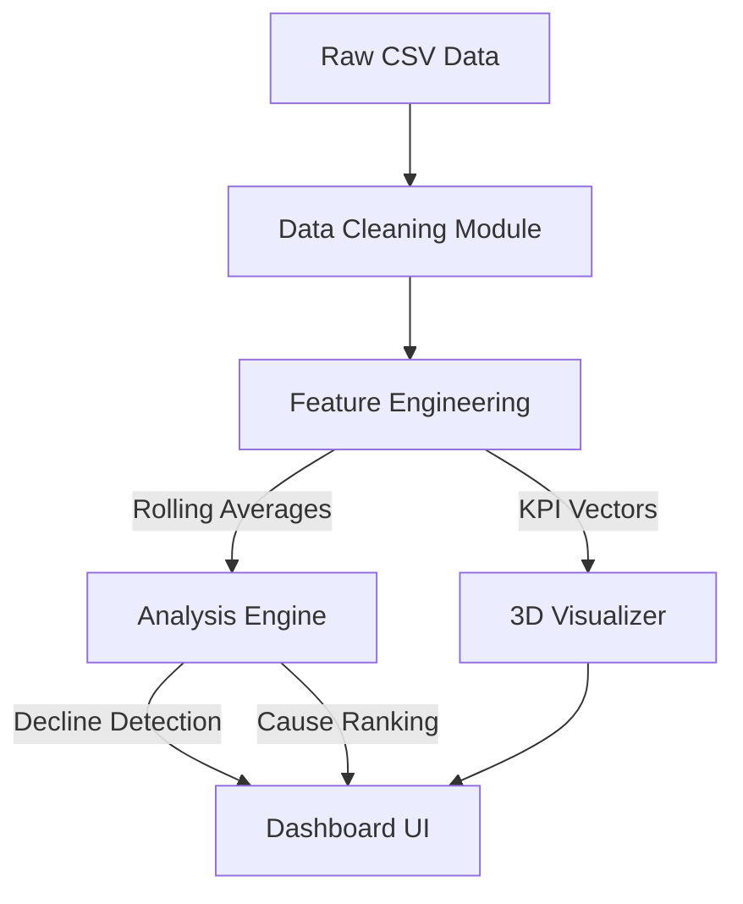

# Supply Chain Intelligence System - Technical Specifications

This document provides a deep dive into the architecture, algorithms, and visualization technologies used in the **Supply Chain Intelligence & Sales Decline Analysis System**.

## 1. Algorithmic Core ("The Code Brain")

Contrary to "black box" machine learning models (like Neural Networks or Random Forests) that require extensive training data, this system uses **Deterministic Explainable AI (XAI)**. This ensures that every insight is 100% traceable to specific data patterns, which is critical for supply chain decision-making.

### Decline Detection Logic
Instead of a predictive regression model, we rely on **Statistical Signal Processing**:
1.  **Peak Detection**: We identify the maximum 3-month rolling average sales (`sales_roll3`) for each product.
2.  **Threshold Trigger**: A decline is flagged if the current rolling average drops by **>15%** (configurable) relative to the global peak.
3.  **Sustain Check**: This drop must persist for **3 consecutive months** to rule out temporary market noise.

### Cause Attribution (Root Cause Analysis)
We use a **Heuristic Rule Engine** to classify the *why* behind a decline. This compares the "Pre-Peak" state vs. the "Post-Decline" state:
*   **Price Elasticity**: `IF price_increase > 5% THEN Cause = "Price Sensitive"`
*   **Customer Sentiment**: `IF rating_drop > 5% THEN Cause = "Satisfaction Drop"`
*   **Market Dynamics**: `IF trend_index_drop > 10% THEN Cause = "Loss of Market Interest"`
*   **Competitive Landscape**: `IF competitor_launch_date within ±2 months THEN Cause = "Competitor Entry"`
*   **Supply Chain Health**: `IF stockout_rate > 10% THEN Cause = "Inventory Shortage"`

## 2. Visualization Engine

The dashboard is built on **Streamlit**, but the heavy lifting for graphics is done by the **Plotly** engine, which runs client-side JavaScript for high-performance interactivity.

### 2D Visualizations (Time-Series & Analysis)
*   **Technology**: `plotly.express.line`
*   **Performance**: Renders vector SVG/Canvas elements.
*   **Features**:
    *   Dynamic hovering (tooltips).
    *   Zoom/Pan capabilities.
    *   Layered annotations (Peak markers, Decline Start vertical lines).
    *   Custom color mapping (`#2E86C1` for sales, `#E74C3C` for alerts).

### 3D Visualizations (Market Positioning)
*   **Technology**: `plotly.express.scatter_3d` (WebGL powered).
*   **Purpose**: To visualize correlations across three dimensions simultaneously:
    *   **X-Axis**: Price (Premium vs. Budget)
    *   **Y-Axis**: Trend Index (High vs. Low Hype)
    *   **Z-Axis**: Sales Volume (Performance)
*   **Interaction**:
    *   Users can rotate, pan, and zoom the 3D cube.
    *   Points are color-coded by **Rating** (Viridis scale) to show quality correlation.

## 3. Technology Stack

| Component | Technology | Purpose |
| :--- | :--- | :--- |
| **Language** | Python 3.10+ | Core logic and data manipulation. |
| **Data Engine** | Pandas / NumPy | High-performance vectorized operations. |
| **Dashboard** | Streamlit | Web application framework. |
| **Graphics** | Plotly (WebGL) | Interactive 2D/3D rendering. |
| **Testing** | Pytest | Unit testing for algorithm stability. |

## 4. System Architecture

## 5. Deployment
The application is container-ready but currently configured for local execution.
*   **Local Run**: `python -m streamlit run dashboard/app.py`
*   **Configuration**: All stylistic elements (e.g., hiding the Deploy button) are handled via CSS injection in `app.py`.
